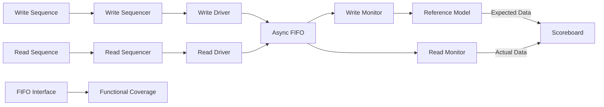

# Async FIFO UVM Verification

一个基于 **SystemVerilog + UVM** 搭建的异步 FIFO（Asynchronous FIFO）验证项目。

本项目针对双时钟异步 FIFO 构建了完整的 UVM 验证环境，包括独立的读写 Agent、Reference Model、Scoreboard、Functional Coverage 以及多种测试场景，用于验证 FIFO 在异步时钟域下的数据传输正确性、FIFO 顺序特性以及 Full / Empty 边界行为。

---

## 1. Project Overview

异步 FIFO 常用于两个不同时钟域之间的数据传输。

本项目中的 DUT 具有独立的：

* Write Clock Domain
* Read Clock Domain

默认参数为：

| Parameter          | Value |
| ------------------ | ----: |
| Data Width         | 8 bit |
| Address Width      | 4 bit |
| FIFO Depth         |    16 |
| Write Clock Period | 10 ns |
| Read Clock Period  | 14 ns |

读写时钟具有不同频率，用于模拟真实的异步跨时钟域数据传输场景。

FIFO 内部采用经典的异步 FIFO 架构：

```text
Binary Pointer
      │
      ▼
 Gray Pointer
      │
      ▼
2-FF Synchronizer
      │
      ▼
Full / Empty Detection
```

二进制指针用于 RAM 地址以及指针递增，Gray Code 指针用于跨时钟域同步。

---

## 2. DUT Architecture

DUT 位于：

```text
rtl/async_fifo.sv
```

主要由以下模块组成：

```text
async_fifo
│
├── fifomem
│     └── FIFO 数据存储
│
├── sync_r2w
│     └── Read Pointer → Write Clock Domain
│
├── sync_w2r
│     └── Write Pointer → Read Clock Domain
│
├── rptr_empty
│     ├── Read Pointer
│     ├── Binary → Gray
│     └── Empty Generation
│
└── wptr_full
      ├── Write Pointer
      ├── Binary → Gray
      └── Full Generation
```

读写指针以 Gray Code 形式经过两级寄存器同步到对方时钟域，以降低多位二进制指针直接跨时钟域采样带来的风险。

### Empty Detection

读时钟域将下一拍 Gray Read Pointer 与同步后的 Gray Write Pointer 进行比较：

```text
Next Gray Read Pointer == Synchronized Gray Write Pointer
                         ↓
                       EMPTY
```

### Full Detection

写时钟域利用 Gray Code 指针最高两位翻转的特征判断 FIFO 是否写满：

```text
Next Gray Write Pointer
          │
          ▼
Compare with synchronized Gray Read Pointer
          │
          ▼
        FULL
```

---

## 3. UVM Verification Architecture

验证环境将读通道和写通道划分为两个独立的 Agent：



验证平台主要由以下部分组成：

```text
                     fifo_env
                        │
        ┌───────────────┼────────────────┐
        │               │                │
        ▼               ▼                ▼
   write_agent      read_agent      fifo_coverage
        │               │
   ┌────┼────┐      ┌───┼────┐
   │    │    │      │   │    │
 Driver SQR Monitor Driver SQR Monitor
             │                 │
             ▼                 │
        fifo_model             │
             │                 │
             └──────┐   ┌──────┘
                    ▼   ▼
                 Scoreboard
```

---

## 4. Transaction

`fifo_transaction` 继承自：

```systemverilog
uvm_sequence_item
```

Transaction 中定义三种操作状态：

```systemverilog
WRITE
READ
IDLE
```

并封装：

```text
op
wdata
rdata
```

其中 `op` 和 `wdata` 被定义为随机变量，为后续构造随机化测试提供基础。

Transaction 通过 UVM Field Automation Macro 注册，可以直接使用 UVM 提供的：

```text
print
copy
compare
factory
```

等机制。

---

## 5. Write Agent

`write_agent` 包含：

```text
write_agent
│
├── write_sequencer
├── write_driver
└── write_monitor
```

### Write Driver

Write Driver 从 Sequencer 获取 Transaction，并将其转换为 DUT 接口上的：

```text
winc
wdata
```

当 FIFO 处于 Full 状态时，Driver 会暂停写操作：

```systemverilog
while(vif.wfull == 1)
```

直到 FIFO 可以继续接受数据。

### Write Monitor

Write Monitor 在 `wclk` 时钟域中观察实际发生的有效写操作：

```text
winc = 1 && wfull = 0
```

并重新构造成 Transaction，通过 Analysis Port 发送到 Reference Model。

Monitor 同时检查：

```text
winc = 1 && wfull = 1
```

如果发现 Full 状态下仍存在有效写使能，则报告 FIFO Overflow Error。

---

## 6. Read Agent

`read_agent` 包含：

```text
read_agent
│
├── read_sequencer
├── read_driver
└── read_monitor
```

### Read Driver

Read Driver 根据 Transaction 产生：

```text
rinc
```

当 FIFO 为空时暂停读操作：

```systemverilog
while(vif.rempty == 1)
```

直到 FIFO 中重新出现有效数据。

### Read Monitor

Read Monitor 负责采集 DUT 实际输出的：

```text
rdata
```

并构造 Read Transaction 发送给 Scoreboard。

同时检查：

```text
rinc = 1 && rempty = 1
```

用于发现潜在的 FIFO Underflow。

---

## 7. Reference Model

`fifo_model` 作为验证环境中的 Reference Model。

Write Monitor 每监测到一次成功写入：

```text
Write Transaction
        │
        ▼
    fifo_model
        │
        ▼
Expected Read Transaction
```

Model 将：

```text
wdata
```

转换为对应的期望：

```text
rdata
```

并发送给 Scoreboard。

因此所有成功写入 FIFO 的数据都会按照写入顺序形成 Expected Data Stream。

---

## 8. Scoreboard

Scoreboard 接收两路数据：

```text
                fifo_model
                    │
                    ▼
              Expected Queue
                    │
                    │
                    ▼
                  Compare
                    ▲
                    │
               Actual Queue
                    ▲
                    │
              read_monitor
```

内部维护：

```systemverilog
fifo_transaction exp_que[$];
fifo_transaction act_que[$];
```

当 Expected Queue 和 Actual Queue 中同时存在数据时：

```text
Expected Data
     VS
Actual Data
```

Scoreboard 按照 FIFO 顺序逐项进行比较。

匹配成功：

```text
Compare SUCCESSFUL
```

匹配失败：

```text
Compare FAILED
```

并通过 `uvm_error` 报告错误。

这种方式实现了一个 **Self-Checking Testbench**，无需完全依靠人工查看波形判断数据正确性。

---

## 9. Functional Coverage

项目包含独立的：

```text
fifo_coverage.sv
```

用于统计 FIFO 的功能覆盖情况。

### Write Clock Domain

覆盖：

* `winc = 0 / 1`
* `wfull = 0 / 1`
* `wfull : 0 → 1`
* `wfull : 1 → 0`
* `winc × wfull` Cross Coverage

并定义非法场景：

```text
Write Enable && FIFO Full
```

### Read Clock Domain

覆盖：

* `rinc = 0 / 1`
* `rempty = 0 / 1`
* `rempty : 0 → 1`
* `rempty : 1 → 0`
* `rinc × rempty` Cross Coverage

并定义非法场景：

```text
Read Enable && FIFO Empty
```

Coverage 分别在：

```text
posedge wclk
posedge rclk
```

进行采样。

---

## 10. Test Cases

项目目前包含以下 Test Case。

### `sanity_test`

基础功能测试。

产生：

```text
10 Write Transactions
10 Read Transactions
```

读写 Sequence 并发运行，用于检查：

* 基本写入
* 基本读取
* FIFO 数据顺序
* Scoreboard 数据一致性

---

### `full_fifo_test`

FIFO Full 边界测试。

连续产生：

```text
20 Write Transactions
```

由于默认 FIFO Depth 为 16，该测试用于使 FIFO 到达 Full 状态并观察：

```text
wfull
```

行为。

---

### `empty_fifo_test`

FIFO Empty 边界测试。

测试流程：

```text
Write 10 Transactions
        │
        ▼
Read Transactions
        │
        ▼
FIFO Empty
```

用于观察 FIFO 被读取至 Empty 时：

```text
rempty
```

的状态变化。

---

### `random_stress_test`

随机压力测试，也是当前 `top_tb` 默认运行的测试。

Write Sequence 和 Read Sequence 分别产生：

```text
100 Transactions
```

并在读写过程中随机插入不同长度的等待时间，从而形成非规则的读写节奏：

```text
Write: ──W──W────────W─W────W──────W──
Read : ─────R──R─R────────R────R──────
```

相比固定周期读写，这种测试能够构造更加复杂的 FIFO Occupancy 变化过程。

---

## 11. Test Result

`base_test` 在 `report_phase` 中读取 UVM Report Server 的 Error 数量：

```text
UVM_ERROR == 0
       │
       ▼
TEST CASE PASSED
```

如果存在 UVM Error：

```text
TEST CASE FAILED
```

从而在仿真结束时自动给出测试结果。

---

## 12. Project Structure

```text
Async_FIFO_Verification/
│
├── rtl/
│   ├── async_fifo.sv
│   └── init
│
├── tb/
│   ├── fifo_if.sv
│   ├── fifo_transaction.sv
│   │
│   ├── write_agent.sv
│   ├── write_driver.sv
│   ├── write_monitor.sv
│   ├── write_sequencer.sv
│   │
│   ├── read_agent.sv
│   ├── read_driver.sv
│   ├── read_monitor.sv
│   ├── read_sequencer.sv
│   │
│   ├── fifo_model.sv
│   ├── fifo_scoreboard.sv
│   ├── fifo_coverage.sv
│   ├── fifo_env.sv
│   │
│   ├── base_test.sv
│   ├── sanity_test.sv
│   ├── full_fifo_test.sv
│   ├── empty_fifo_test.sv
│   ├── random_stress_test.sv
│   │
│   ├── top_tb.sv
│   └── caogao.sv
│
└── sim/
    └── init
```

---

## 13. Current Simulation Configuration

当前 `top_tb.sv` 默认包含：

```systemverilog
`include "random_stress_test.sv"
```

并运行：

```systemverilog
run_test("random_stress_test");
```

因此当前工程默认执行：

```text
random_stress_test
```

仿真器需要支持：

* SystemVerilog
* UVM

当前仓库尚未加入统一的 Makefile / regression script，因此具体编译命令需要根据使用的仿真器进行配置。

---

## 14. Verification Features

本项目实践了以下数字 IC 验证技术：

* SystemVerilog
* UVM
* Transaction Level Modeling
* Sequence / Sequencer / Driver
* Independent Read / Write Agents
* Monitor
* Analysis Port
* TLM Analysis FIFO
* Reference Model
* Scoreboard
* Self-Checking Testbench
* Functional Coverage
* Cross Coverage
* Illegal Bins
* Random Stress Testing
* Clock Domain Crossing
* Gray Code Pointer Synchronization
* FIFO Full / Empty Verification

---

## 15. Key Features

### Independent Read / Write Verification Agents

针对异步 FIFO 的两个独立时钟域分别搭建 Read Agent 和 Write Agent，使验证结构与 DUT 的双时钟域结构保持一致。

### Reference Model + Scoreboard

通过：

```text
Write Monitor
      ↓
Reference Model
      ↓
Expected Data
      ↓
Scoreboard
      ↑
Actual Data
      ↑
Read Monitor
```

建立完整的数据自检链路。

### Functional Coverage

使用 Covergroup、Coverpoint、Transition Bin、Cross Coverage 和 Illegal Bin 对 FIFO 的关键工作状态进行统计。

### Boundary Condition Checking

Write Monitor 和 Read Monitor 分别加入 Overflow / Underflow 检查，对 FIFO 边界状态进行监测。

### Asynchronous Clock Verification

写时钟和读时钟采用不同周期运行，使 DUT 工作在真正的双时钟异步环境中。

---

## 16. Future Work

后续计划继续完善：

* [ ] 优化 Full / Empty 边界 Test Case 的退出机制
* [ ] 支持通过 `+UVM_TESTNAME` 灵活选择 Test Case
* [ ] 增加统一的 Makefile / Regression Script
* [ ] 增加 SystemVerilog Assertions
* [ ] 增加 Reset During Traffic 测试
* [ ] 增加更多 Write / Read Clock Ratio
* [ ] 完善 Read / Write Functional Coverage Report
* [ ] 增加 Code Coverage
* [ ] 增加多 Seed Regression
* [ ] 增加自动化 Coverage Closure

---

## 17. RTL Attribution

`rtl/async_fifo.sv` 中的异步 FIFO RTL 基于经典的 asynchronous FIFO design 技术实现。

原始文件头中注明该设计基于 Cliff Cummings 的异步 FIFO 设计方法，并包含 Jason Yu 的版权及 GNU GPL 许可声明，同时包含为验证环境兼容性所做的修改说明。

使用或再发布该 RTL 时应保留原文件中的版权及 License 信息。

---

## 18. Author

**ReZezz**

This repository is used for learning and practicing:

```text
SystemVerilog
UVM
Digital IC Verification
Asynchronous FIFO
Clock Domain Crossing
Functional Coverage
```
